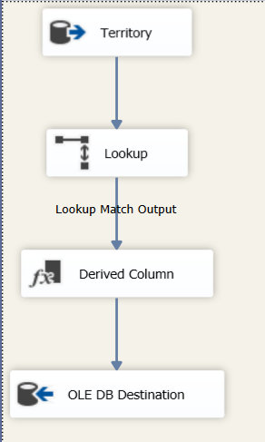

# Building-Sales-Data-Mart-Using-SSIS
The goal of this project is design and implement a Sales Data Mart using SSIS , SQL Server. This centralized repository will allow for comprehensive reporting, trend analysis, and data-driven decision-making for sales teams, business analysts, and management.
# Key Features
Data Source:

Restored AdventureWorks2014 as a source database into SQL Server.

Data Mart Design:

Created a star schema with Fact (FactSales) and Dimension tables (DimCustomer , DimProduct , DimTerritory , DimDate).
# ETL Processes:

Implemented SSIS packages to extract, transform, and load data to data warehouse.
Incorporated Slowly Changing Dimensions (SCD) for DimCustomer and DimProduct to track historical changes in dimension attributes.

# Tools
* SQL Server
* SSIS

# Star Schema

# DimCustomer package

# DimProduct package

# DimTerritory package

# DimDate package

# FactSales Full Load package

# FactSales Incremental Load package

